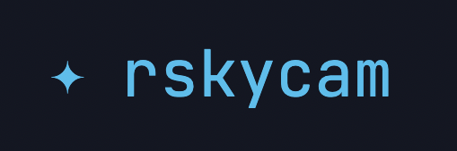

<p align="center"></p>

An all-sky camera for the Raspberry Pi. One binary runs the capture loop
and serves a web dashboard — live view, nightly keograms/star-trails/
timelapses, and an astro overlay grid — with no cloud service and no app
to install. Works with a CSI camera (imx219/rpicam) or a ZWO ASI camera,
and optionally a BME280 environmental sensor over I2C.

## Features

- Live dashboard with current frame, exposure/gain, CPU/RAM/disk, and
  sun/moon altitude
- Automatic day/night capture with auto-exposure
- Per-night keogram, star trails, and day/night timelapse (rendered with
  ffmpeg)
- Astro overlay — alt/az and RA/Dec grids, cardinal directions —
  calibrated to your specific lens and mounting
- Focus assist (HFD-based, ASIAir-style) for dialing in sharpness at night
- Dark-frame calibration for ZWO ASI cameras
- Optional BME280 sensor overlay (temperature / humidity / pressure)
- Configurable frame and artifact retention
- Single admin login; everything runs locally on the Pi, no cloud account

## Install on a Raspberry Pi

On a Raspberry Pi OS (64-bit) machine:

```bash
curl -fsSL https://raw.githubusercontent.com/awitwicki/rskycam/main/installer/install.sh | sudo bash
```

This installs `ffmpeg`, downloads the latest release, creates a
`rskycam` system user with data dir `/var/lib/rskycam`, installs the
ZWO udev rule and a hardened systemd service, and starts it. It prints
the dashboard URL when done (port 8080).

## Log in

Open `http://<your-pi-hostname-or-ip>:8080`. Default credentials:

- **Username:** `admin`
- **Password:** `pa$$word!0`

Change the password from **Settings** right after your first login.

---

For updating/uninstalling, local development, running without hardware,
and other technical notes, see [DEVELOPMENT.md](DEVELOPMENT.md).
